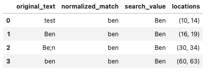

# NormTree Text Search 

This library is for normalized text search. Given a list of search terms and normalizing operations this searches the given text for the normalized terms and then returns the match locations in the original text. 

Inputs: 
- Text
- search terms
- replacement pairs
- strip characters

Output: 
- A df with detections and matches


Example:

``` python
text = 'This is a test, Ben was here. Be;n was here. Be*n was here. ben was here.'
search_terms = ['Ben']
replacement_pairs = {'test':'Ben', ';':''}
strip_chars = '*'


results = normalized_text_search(text, 
                                 search_terms,
                                 replacement_pairs,
                                 strip_chars)

results

```



The output is a pandas df with matches and locations

